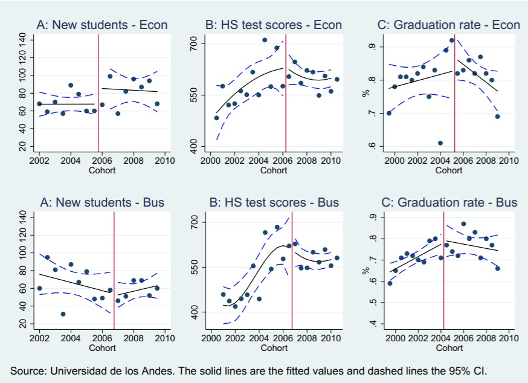
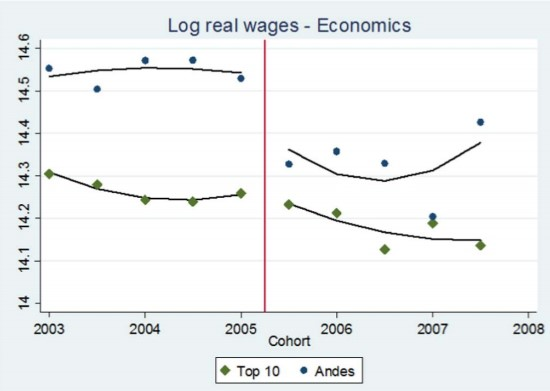
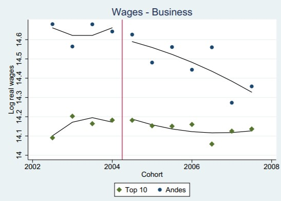

```{r setup, include=FALSE}
knitr::opts_chunk$set(echo = FALSE)
library(tidyverse)
theme_set(theme_gray(base_size = 15))
```

## Identification

- As I hinted at last time, *identification* is the process of ensuring that *the estimate you make* actually is an estimate of *the theoretical thing you're trying to estimate*
- It's a problem that's theoretical in nature even though it has a statistical solution!
- The question is *what theoretical concept is captured by our estimate?* and *is that the theoretical concept we want?*

## Example

- Let's say we want to know whether going to the opera makes you live longer
- So we run the following regression: $Lifespan = \beta_0 + \beta_1Opera + \varepsilon$ where $Opera$ is the number of times per year you go to the opera
- What do we want to estimate?
- What will $\beta_1$ estimate?

## Example

- The estimate of $\beta_1$ we get will tell us *how the conditional mean of $Lifespan$ changes as $Opera$ changes*, but what we want is *whether going to the opera more makes you live longer*
- If we see a positive $\beta_1 > 0$, that *could* be because opera makes you live longer, but we can't rule out that it's longer-living people choosing to go to the opera
- So, that regression does not *identify* the effect we want

## Correlation and Causation

- In the opera example, this is clearly just a case of "correlation is not causation" but the idea of identification is a little more helpful that that
- Because really, some correlations *are* causal. Every causation is *some* correlation (often a conditional one)
- The task is figuring out *which correlation* identifies our effect of interest

## The Good Variation

- Variables vary. Sort of the point.
- Two variables can be related
- **Why** do they vary? **Why** are they related
- Usually you're only interested in one of the reasons
- And that reason accounts for only *part of the variation*. Which part?

## The Good Variation

Why might opera and lifespan be related? 

- Wealthier people are more likely to go to the opera, and wealth can increase your lifespan for many reasons
- People with certain chronic life-shortening illnesses may find it difficult to go to the opera
- Older people are more likely to go to the opera, so you need a long lifespan in the first place to get to the opera-going part of your life
- Maybe opera really does make you live longer

## The Good Variation

- All those other explanations are *reasons why we might see longer-lived people going to the opera more*
- Which is why, *when we observe longer-lived people going to the opera more*, we can't just say it's becuase opera makes you live longer
- But we can get our answer! We simply have to *remove the variation that's due to those other explanations*, or *isolate just the variation we're interested in* in some way

## The Good Variation

- One way of *removing variation due to other explanations* is controls
- As we demonstrated with Frisch-Waugh-Lovell, adding a control *removes the variation that can be explained by the control variable*
- It does this from both $X$ and $Y$, removing that part of the relationship, and *removing that reason why they're related*
- If we can do this for *all* alternative explanations, we can isolate the variation we want and identify the effect!

## Experiments

- Or, we can limit the data to allow only the variation we want
- An experiment is one way of doing this. 
- If you can randomly assign people to go to the opera, then the *only variation* in opera-going in your sample is unrelated to anything like wealth, previous health, or previous age
- So the *only part of the opera/lifespan relationship there can possibly be is if opera causes lifespan* 
- For this reason, you'd never, say, run an experiment, but then estimate the model using your experiment data *as well as* a bunch of other non-experimental data. Then you're back to multiple explanations!

## Causal Inference

- Identification means *isolating just the reason you want* as to why two variables are related
- Causal inference is all about finding *which kinds of variation we need to remove* to do this, and then doing it
- Or *isolating just the variation we need to keep*, often using experiments, or things that are experiment-like

## Example

- Let's start with an example where we know the answer

```{r, echo = TRUE}
# Observational sample
tb_obs <- tibble(epsilon = rnorm(200), W = rnorm(200), origin = 'Observational') %>%
  mutate(X = W + rnorm(200) > 0) %>% mutate(Y = 3*X - 2*W + epsilon)

# Experimental sample
tb_exp <- tibble(epsilon = rnorm(200), W = rnorm(200), X = rnorm(200) > 0, origin = 'Experimental') %>%
  mutate(Y = 3*X - 2*W + epsilon)

# Together!
tb <- bind_rows(tb_obs, tb_exp)
```

## Example

- How can we check whether a given method gives us the true causal effect of $X$ on $Y$ of $3$?
- Simulate it! Create the data many times, try our method each time, and see the mean and sampling distribution of what we get

```{r, echo = TRUE}
create_data <- function() {
  tb_obs <- tibble(epsilon = rnorm(200), W = rnorm(200), origin = 'Observational') %>%
    mutate(X = W + rnorm(200) > 0) %>% mutate(Y = 3*X - 2*W + epsilon)
  tb_exp <- tibble(epsilon = rnorm(200), W = rnorm(200), X = rnorm(200) > 0, origin = 'Experimental') %>%
    mutate(Y = 3*X - 2*W + epsilon)
  tb <- bind_rows(tb_obs, tb_exp)
  return(tb)
}
```

## Example

- Let's try regular ol' regress-$Y$-on-$X$. Shouldn't work.

```{r, echo = FALSE}
set.seed(1000)
```

```{r, echo = TRUE}
run_model <- function(x) {
  m <- lm(Y~X, data = create_data())
  return(coef(m)[2])
}

library(purrr)
1:1000 %>% map_dbl(run_model) %>% mean()
```

## Example

- The mean of the sample distribution is off because our analysis has not eliminated the other reasons ( $W$ ) why $X$ and $Y$ might be related
- In this case $W$ makes them *more negatively* related - still counts
- How can we identify the effect?

## Eliminate Alternative Explanations

- We can remove the variation in $X$ and $Y$ generated by $W$, leaving $X \rightarrow Y$ as the only possible explanation for their relationship
- We know this identifies the effect *not because we got the right answer* (in the real world we don't know what the right answer is!) but because *based on our understanding of the data, this accounts for all alternative explanations*
- Let's try it with a regression control

## Eliminate Alternative Explanations

```{r, echo = TRUE}
run_model_2 <- function(x) {
  m <- lm(Y~X + W, data = create_data())
  return(coef(m)[2])
}

1:1000 %>% map_dbl(run_model_2) %>% mean()
```
## Isolate Good Variation

- Some portion of the variation identifies our effect (the portion not explained by $W$)
- With the control we shaved away the $W$ variation to get what we want
- But sometimes we can just locate and isolate the variation we want
- Here, we know that the variation *among the experimental sample* identifies our effect, since among that sample there's no alternative explanation

## Isolate Good Variation

```{r, echo = TRUE}
run_model_3 <- function(x) {
  m <- lm(Y~X, data = create_data() %>% filter(origin == 'Experimental'))
  return(coef(m)[2])
}

1:1000 %>% map_dbl(run_model_3) %>% mean()
```

## Key Concepts

- There is an *underlying true theoretical model*
- We *want to estimate a particular part of that model * (generally, the causal effect of something on something else)
- That model tells us *how the data is generated* ("Data Generating Process")
- So when we *see the data*, we know all the reasons why two variables might be related
- If we want to pick out just that causal effect, we must isolate the right variation, eliminating alternative explanations
- Variation means *differences we can compare*, i.e. "who are we comparing for whom their differences identify the effect?"


## Arteaga 2018

- As an example, we will look at the 2018 Carolina Arteaga study, "[The Effect of Human Capital on Earnings](https://www.sciencedirect.com/science/article/pii/S0047272717301809)"
- We know that education increases earnings from other studies ( $Education \rightarrow Earnings$ )
- But *why*? Two prominent explanations in economics: (1) education improves skill (human capital), which improves earnings because you become a better worker, or (2) education lets you show off your skills (signaling), which improves earnings because you can convince employers you were already a good worker
- How can we isolate the (1) effect?

## Arteaga 2018

- Imagine we see that people with more education earn more money. What might be the reasons for that?
- It improves skill (human capital)
- It lets you show off skill (signaling)
- It gives you connections (networking)
- It doesn't do anything, but for various reasons people who would have earned more anyway get more education (selection)
- Other reasons!

## Arteaga 2018

- From that, we know that simply looking at the raw earnings/schooling relationship doesn't **identify** the human capital effect
- (and keep in mind, there are multiple effects we might *want* to identify. Identification is about the theoretical concept you *want*. Signaling would also be a way education would cause earnings, and a different study would want to identify that effect, but we don't want that here)
- How can we isolate just the variation that represents human capital

## Arteaga 2018

- Arteaga **thinks about the theoretical concepts at play** and says "variation related to *what you learn* is what we want, but variation related to *what the employer can see* is not, since that can be a signal"
- So we must find cases where *some people got more school and others got less* (variation), but in a way that *changed what they learned but not what the employer sees* (identifying the human capital effect)

## Arteaga 2018

- She found a top Colombian business school that reduced the number of classes required to graduate (changes what you learn, so variation in human capital), but not in a way that would be immediately apparent to employers (no variation in signaling)
- Looking at students in the *same program* (no selection differences, no networking differences) before and after the change should identify **only** the human capital effect
- What's left? We're doing a before/after comparison so there might be some wage changes over time, so we also remove any time variation in wages at *other* top business programs

## Arteaga 2018

- What does this mean?
- If we're right about what variation this particular setting *excludes*, then there shouldn't be any difference in the kinds of students passing through from before the change to after
- And we can get the *effect of the reduced class material* by looking at wage changed before/after, compared to those same before/after changes at other institutions
- This will be evidence of a human capital effect!

## Arteaga 2018



## Arteaga 2018



## Arteaga 2018



## Arteaga 2018

- Notice how our approach to identification had *nothing to do with a regression*
- The paper has a regression too, but we did this all with graphs! 
- Regression is one way to get at these effects, but it is only a tool to help is isolate variation when we want to get certain types of conditional conditoinal means
- But it is *only* a tool. Our real goal is to figure out what variation we want and think about how we can use data and setting to isolate it. Maybe we do that with regression, maybe not

## Agan & Starr 2017

- Let's look through the (very short) paper by Again & Starr 2017. 
- They do a "field experiment" (i.e. they've randomized something but it's not done in a fully controlled lab setting)
- But that doesn't get them off the hook of thinking about identification!

## Agan & Starr 2017

Discussion questions:

- How do they think about the *reasons why treatment* (criminal record) *and outcome* (job callbacks) are related?
- What variation are they interested in?
- How do they plan to isolate that variation? Why do they think it will work?
- What alternative explanations might remain? Why don't they get rid of them?

## Next Time

- Next time we'll be discussing an approach to modeling out these sorts of scenarios so we can know exactly how to identify the effects we want
- These are known as *causal diagrams*