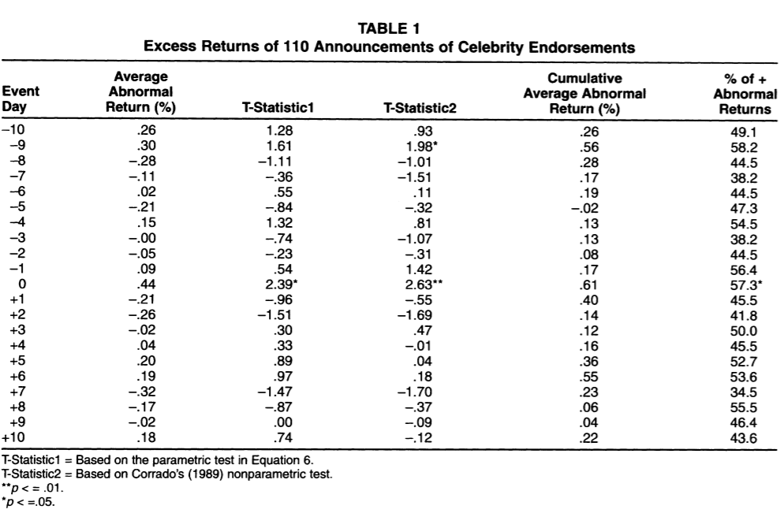
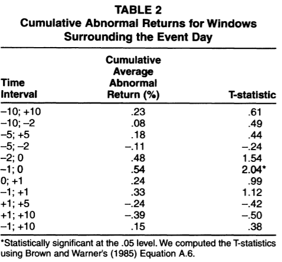
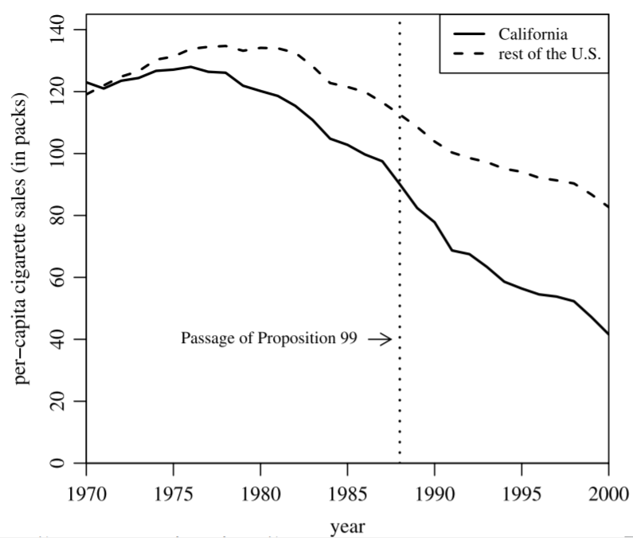
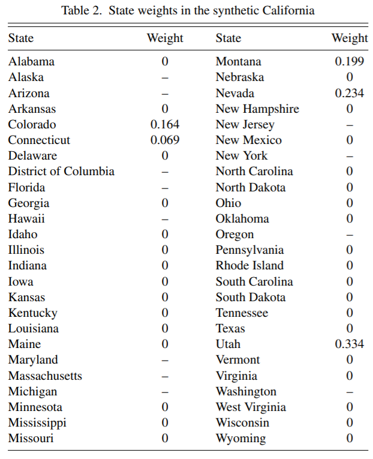
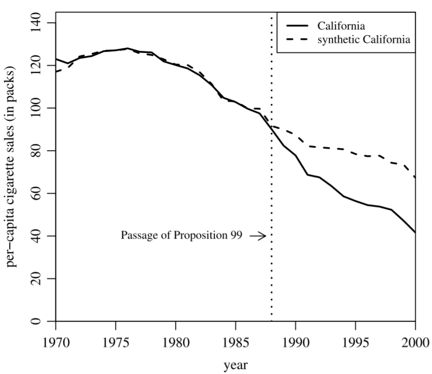
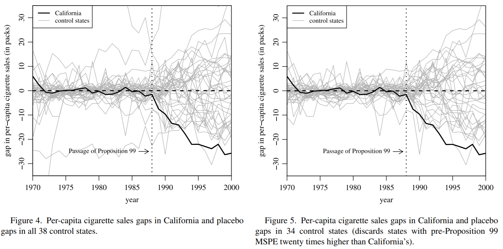

```{r setup, include=FALSE}
knitr::opts_chunk$set(echo = FALSE, warning=FALSE, message=FALSE)
library(tidyverse)
library(dagitty)
library(ggdag)
library(gganimate)
library(ggthemes)
library(Cairo)
library(ggpubr)
theme_set(theme_gray(base_size = 15))
```

## Recap

- So far, the method we've used have relied on access to a bunch of treated individuals, so we can average over them to get an idea of the outcome conditional on treatment
- But many treatments we might be interested in are only applied to *one* group in *one case*
- What can we do?
- We can use *case methods*

## The Problem

- Why is this likely to be a special problem?
- For one, we have very little data! Only one treated group means that you only have a handful of pre- and post-treatment observations
- It's harder to believe we can abstract away "what's different" about that group when we can't average over a few groups
- Can't control for group-specific stuff
- Can aggregate multiple case effect estimates

## Approaches

- Event studies (the case alone)
- Synthetic control (the case vs. control groups)

## Event Studies

- In an event study, you are really asking the question "what changed when treatment went into effect?"
- At its core it's just a before/after comparison
- With some bells and whistles

## The Basic Problem

- Our diagram looks like difference-in-differences wbut without the control group
- If anything else is changing over time, we have a back door!

```{r, dev='CairoPNG', echo=FALSE, fig.width=6,fig.height=3.75}
dag <- dagify(Y~D+Time,
              D~Time,
              coords=list(
                x=c(D=1,Y=3,Time=2),
                y=c(D=1,Y=1,Time=2)
              )) %>% tidy_dagitty()
ggdag_classic(dag,node_size=20) + 
  theme_dag_blank()
```

## Hmm...

- Our actual goal in identifying an effect using before/after data is to figure out *what after would have looked like* for the treated group if no treatment had occurred
- DID says "let's see how a different group changed and assume the treated group would have changed in the same way"
- Event studies say "let's see how the treated group was changing before and use that to predict how it would have continued to change"

## Another way to think about it

- Rather than thinking of event studies as being like DID but without a control group, we can think of them as a RDD but with time as a running variable, and a cutoff when treatment was introduced
- One simple form of event study estimation actually uses the same regression equation

$$ Y = \beta_0 + \beta_1Time + \beta_2After + \beta_3Time\times After $$

with $\beta_2$ as the event study estimate

## The Time Issue

- RDD works pretty good, so event studies seem pretty solid too, right? Ehhh...
- The assumption that nothing else changes at the cutoff is a bit harder to believe for time as a running variable. Things change over time!
- Some studies, especially in high-frequency finance data, make this more believable by looking at *really tiny time intervals*
- If you have second-to-second data, and your bandwidth is like 10 minutes on either side, then yeah, probably nothing else changed at the cutoff
- Of course this also requires that the effect of treatment has to kick in real quick!

## Forecasting

- More often in areas where event studies are used to identify causal effects (and not just, say, check the plausibility of a DID design), they use *forecasting* tools
- We want to predict the counterfactual after treatment as if no treatment had occurred
- So... let's look at the trend before treatment and assume that continues!
- (a) estimate a time-series model using pre-treatment data, (b) forecast post-treatment data, (c) compare to outcomes

## Forecasting

- Plus, we know how to calculate confidence intervals for forecasts, so that's an easy way to see if the outcomes we observe are statistically significant
- Doing this properly requires effectively using forecasting tools in time series analysis, which is not something I'm going to delve into super deeply in this class
- So let's just see an simple example simulation and an example study

## Simulation

```{r, echo = TRUE}
set.seed(1000)
tb <- tibble(Time = 1:100) %>%
  mutate(After = Time >= 80) %>%
  # Increasing overall trend, plus treatment effect
  mutate(Y = .1*Time - .001*(Time-20)^2 + 4*After + rnorm(100)) 

# Add an AR(1) process to the data
for (i in 2:100) {
  tb$Y[i] <- tb$Y[i] + .05*tb$Y[i-1]
}
```

## Simulation

What do we have?

```{r, echo = FALSE}
ggplot(tb, aes(x = Time, y = Y)) + 
  geom_line(size = 1, color = 'blue') + 
  geom_vline(aes(xintercept = 80), linetype = 'dashed') +
  theme_pubr()
```

## Simulation

- Now let's use some forecasting tools to predict what would have happened without treatment

```{r, echo = TRUE}
library(tsibble); library(fable)

tbts <- as_tsibble(tb, index = Time)

# Pretend we don't know the order and try up to AR(3) with trend
m <- tbts %>%
  filter(!After) %>%
  model(AR(Y ~ Time + I(Time^2) + order(1)))

predictions <- forecast(m, newdata = tbts %>% filter(!After), h = 20)
effect <- mean(tbts %>% filter(After) %>% pull(Y)) - mean(predictions$.mean)
effect
```

## Simulation

- Clearly the time-series modeling could already use some work here but you get the idea!

```{r, echo = FALSE}
tbts <- left_join(tbts, fitted(m))

autoplot(predictions) + 
  geom_line(data = tbts, mapping = aes(x = Time, y = .fitted)) + 
  geom_line(data = tbts, aes(x = Time, y = Y), color = 'blue', size = 1) + 
  geom_vline(aes(xintercept = 80), linetype = 'dashed') + 
  theme_pubr()
```

## Alternately

- An opposing "nonparametric" approach uses other methods to remove the expected value of $Y$ and then just sees how $Y$ changes at the time of the event
- In finance there are "Abnormal returns" which are returns minus expected returns (given things like market conditions, firm conditions)
- What do ARs look like as we go up to the event day and after?

## Agrawal and Kamakura

- It's a little old, but [Agrawal and Kamakura 1995](https://www.jstor.org/stable/pdf/1252119.pdf) look at the effect of celebrity endorsement on stock price
- They calculate abnormal returns based on price minus expected price (based on market movement). Commonly this might also account for other things that would let us predict stock movements
- And then just take averages in the days leading up to a celebrity endorsement, the day, and then after

## Agrawal and Kamakura

```{r}

```
## Agrawal and Kamakura

```{r}

```

## Agrawal and Kamakura

- They find a positive effect of .44 on the price on the day of the announcement and not on other days
- Convincing? Up to you
- Might have been luck... they did check a lot of days!
- But the effect only being on the day of announcement does look good

## Synthetic Control

- What if we can't build a plausible event study-the data is too slow, or we do think there are time trends that our modeling can't handle?
- Then we bring in the comparison groups! Time for synthetic control
- This is vaguely similar to difference-in-differences: see how the treatment and control groups changed from before to after, and see how much more the treated group changed

## Synthetic Control

However!

1. Rely on a long time series *before* treatment
1. Use a weighted average of a candidate set of "donor" control groups
1. Select the weights based on control variables AND outcome, so that the time trend of the outcome for treatment shold match the time trend for the controls almost exactly
1. Cancel the whole thing if the MSPE (mean squared prior prediction error) is too high - bad matches!
1. Since we have a case treatment, use "randomization inference" (i.e., a buncha placebo tests) to calculate a p-value

## Assumptions

- The key assumption for synthetic control you can probably guess
- We must assume that, in the absence of treatment, the trend would have continued without a jump
- i.e. nothing else is happening at/near the same time to the treatment group that doesn't also happen to the controls - how could we possibly tease them apart?

## Selecting Comparisons

- Start with a "donor pool" of control groups
- Basically you just select a set of weights that minimize the difference between the treatment and weighted-control outcomes in the prior period
- That's it! The rest is implementation details, such as how to account for covariates, how much to weight different periods, and so on.

## Abadie, Diamond, and Hainmueller

- The classic study is Abadie, Diamond, and Hainmueller (2010) and looks at the California Tobacco Control program, implemented only in California in 1988
- Donor pool: all other states
- Outcome: per-capita cigarette sales

## Raw Data

```{r}

```

## Weighting

```{r}

```

## Synthetic Control

```{r}

```

## Inference

```{r}

```

## Inference

```{r}
knitr::include_graphics('Lecture_17_Abadie_5.png')
```

## Doing Synthetic Control

- Let's take a look at the [Mixtape example](https://mixtape.scunning.com/ch9.html)
- (note **SCtools** is on CRAN now)

## Concept Checks

- What issues would we have with just applying typical methods we've already used in case contexts?
- Intuitively, what are the assumptions we're making when we do these case methods?
- Why might functional form issues be even more important for event studies than for regression discontinuity?